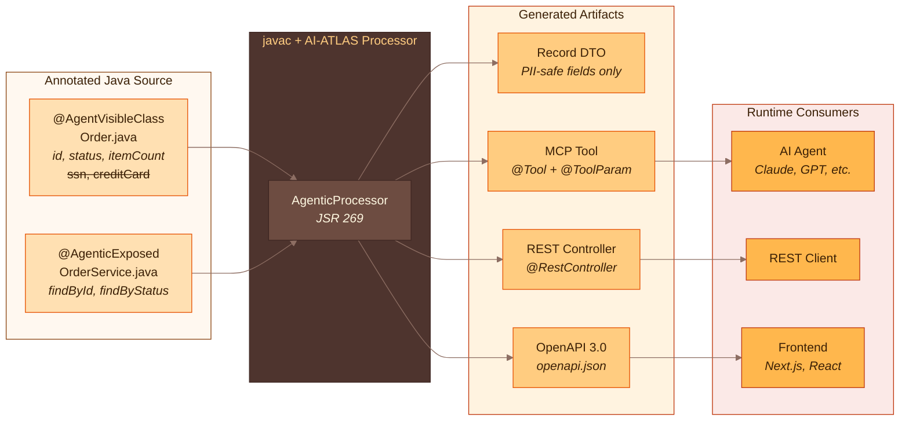
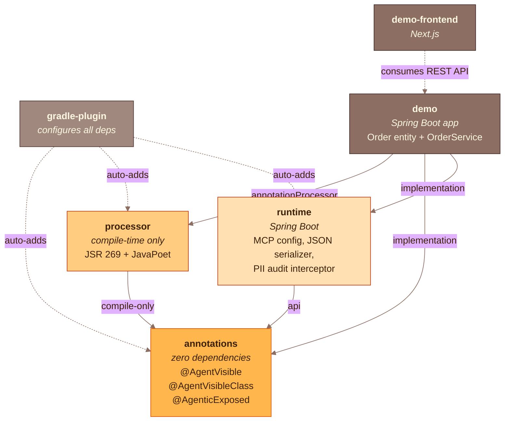
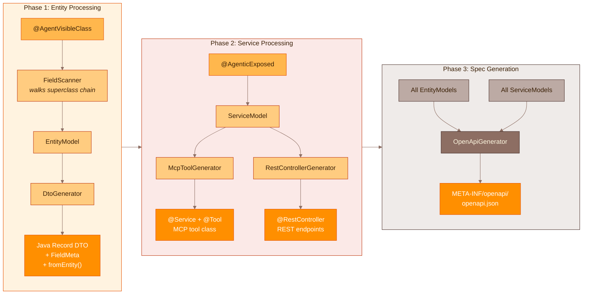
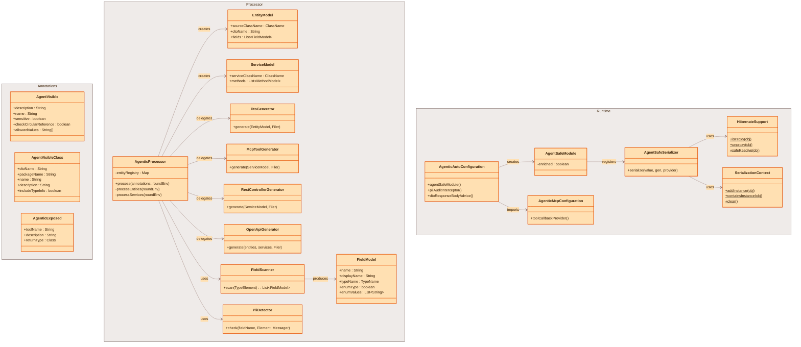

[](https://github.com/gosha70/ai-atlas/actions/workflows/ci.yml)
[](https://central.sonatype.com/artifact/com.egoge/ai-atlas-annotations)
[](LICENSE)
[](https://openjdk.org/projects/jdk/21/)

<h2>
  
    <p>AI Annotation-Driven Tooling & Layered API Synthesis</p>
</h2>

## Why AI-ATLAS?

### The Scale Problem

Enterprise Java applications contain hundreds of CRUD services with embedded business logic. These services are essential to composing agentic AI workflows, but today developers must manually enable [MCP](https://modelcontextprotocol.io/) (Model Context Protocol) servers for each service — writing `@McpTool` methods, hand-crafting DTOs, mapping entity fields, and registering tools one by one. For an enterprise with 200+ services, this is months of tedious integration work that introduces security risks through direct, unfiltered exposure of internal data models.

### The PII Security Gap

Entity classes mix business data (order status, item count) with sensitive data (SSNs, credit card numbers, passwords). Exposing services to AI agents risks leaking PII through unfiltered access to internal models. This maps directly to [OWASP API Security Top 10:2023 API3](https://owasp.org/API-Security/editions/2023/en/0xa3-broken-object-property-level-authorization/) — Broken Object Property Level Authorization.

### Whitelist Beats Blacklist

Traditional approaches like `@JsonIgnore` use **blacklisting** — every PII field must be explicitly excluded. A developer adding a new PII field who forgets the exclusion annotation creates an immediate data leak. AI-ATLAS inverts this with **whitelisting** via `@AgentVisible`: only annotated fields are included. Forgetting the annotation is safe — the field simply does not exist in the generated DTO.

### No Existing Tool Does This

No existing tool combines auto-discovery of existing services, MCP tool generation, REST controller generation, and built-in PII filtering at compile time:

| Capability | Spring AI MCP | Spring Data REST | JHipster | swagger-to-mcp | **AI-ATLAS** |
|---|---|---|---|---|---|
| Auto-discover existing services | Manual | Repos only | New apps | Needs spec | **Yes** |
| MCP generation | Manual | — | — | From spec | **Auto** |
| REST generation | — | From repos | From DSL | — | **Auto** |
| Built-in PII filtering | — | — | — | — | **Yes** |
| OpenAPI spec generation | — | Partial | Yes | Consumes | **Auto** |
| Compile-time generation | Runtime | Runtime | Templates | Build-time | **APT** |

### Retrofit, Not Greenfield

AI-ATLAS is designed to retrofit **existing** enterprise codebases. Add two annotations to existing entity and service classes, run a build, and the full AI-enablement layer is generated. No rewriting services, no new application scaffolding — unlike JHipster which generates new applications rather than wrapping existing ones.

## The Solution

AI-ATLAS is a **compile-time annotation processor** that generates PII-safe API layers from two simple annotations:

- **`@AgentVisible`** on entity fields — whitelist what AI agents can see
- **`@AgenticExposed`** on service classes — expose methods as MCP tools and REST endpoints

Everything else is structurally excluded. There is no way for unannotated fields to reach the generated API — the safety guarantee is enforced by the Java compiler, not runtime checks.

From these annotations, the processor generates four artifacts at compile time:

| Generated Artifact | Purpose |
|---|---|
| **Java record DTO** | Contains only `@AgentVisible` fields with a null-safe `fromEntity()` factory |
| **MCP tool class** | Spring AI `@Tool`-annotated service for AI agent interaction via [Model Context Protocol](https://modelcontextprotocol.io/) |
| **REST controller** | Spring `@RestController` with `@PostMapping`/`@GetMapping` endpoints returning DTOs |
| **OpenAPI 3.0 spec** | Machine-readable API description at `META-INF/openapi/openapi.json` |

## High-Level Architecture

### End-to-End Overview


- _[JSR 269](https://jcp.org/en/jsr/detail?id=269)  Pluggable Annotation Processing API_

### Module Architecture

Six modules with strict dependency boundaries:



### Annotation Processing Pipeline

The processor executes in three phases during `compileJava`:



### Component Structure



## How It Works

Given an entity with mixed safe and sensitive fields:

```java
@AgentVisibleClass(
    name = "order",
    description = "A customer order with status tracking and item summary"
)
public class Order {
    public enum OrderStatus {
        PENDING, CONFIRMED, SHIPPED, DELIVERED, CANCELLED
    }

    @AgentVisible(description = "Unique order identifier")
    private Long id;

    @AgentVisible(description = "Current order status")
    private OrderStatus status;

    @AgentVisible(name = "totalCents", description = "Total order amount in cents")
    private long totalAmountCents;

    @AgentVisible(description = "Number of items in the order")
    private int itemCount;

    // PII — NOT annotated, structurally excluded from all generated code
    private String customerName;
    private String customerEmail;
    private String shippingAddress;
    private String creditCardNumber;
    private String customerSsn;
}
```

And a service:

```java
@AgenticExposed(description = "Order management operations", returnType = Order.class)
@Service
public class OrderService {
    public Order findById(Long id) { ... }
    public List<Order> findByStatus(String status) { ... }
}
```

Running `./gradlew build` generates:

**PII-safe DTO** — only the 4 whitelisted fields, no customer name, no SSN, no credit card. Includes compile-time metadata (field descriptions, enum valid values, circular reference flags) for runtime enriched JSON:

```java
@Generated("com.egoge.ai.atlas.processor")
public record OrderDto(Long id, OrderStatus status, long totalAmountCents, int itemCount) {

    public record FieldMeta(String description, List<String> validValues,
                            boolean sensitive, boolean checkCircularReference) {}

    public static final String CLASS_NAME = "order";
    public static final String CLASS_DESCRIPTION = "A customer order with status tracking and item summary";
    public static final boolean INCLUDE_TYPE_INFO = true;

    public static final Map<String, FieldMeta> FIELD_METADATA = Map.ofEntries(
        Map.entry("id", new FieldMeta("Unique order identifier", List.of(), false, true)),
        Map.entry("status", new FieldMeta("Current order status",
            List.of("PENDING", "CONFIRMED", "SHIPPED", "DELIVERED", "CANCELLED"), false, true)),
        Map.entry("totalCents", new FieldMeta("Total order amount in cents", List.of(), false, true)),
        Map.entry("itemCount", new FieldMeta("Number of items in the order", List.of(), false, true))
    );

    public static OrderDto fromEntity(Order entity) {
        if (entity == null) return null;
        return new OrderDto(
            entity.getId(), entity.getStatus(),
            entity.getTotalAmountCents(), entity.getItemCount());
    }
}
```

**MCP tool** — AI agents call this via MCP protocol, responses are always DTOs:

```java
@Generated("com.egoge.ai.atlas.processor")
@Service
public class OrderServiceMcpTool {
    private final OrderService service;
    // constructor injection...

    @Tool(name = "findById", description = "Order management operations")
    public OrderDto findById(@ToolParam(description = "id") Long id) {
        return OrderDto.fromEntity(service.findById(id));
    }
}
```

**REST controller** — standard Spring endpoints, also returning DTOs:

```java
@Generated("com.egoge.ai.atlas.processor")
@RestController
@RequestMapping("/api/v1/order-service")
public class OrderServiceRestController {
    @PostMapping("/find-by-id")
    public OrderDto findById(@RequestParam Long id) { ... }

    @PostMapping("/find-by-status")
    public List<OrderDto> findByStatus(@RequestParam String status) { ... }
}
```

## PII Safety Architecture

### Defense-in-Depth

AI-ATLAS provides a layered security strategy for PII protection:

| Layer | Mechanism | Guarantee | Status |
|-------|-----------|-----------|--------|
| **1. Compile-time** | Generated DTOs structurally exclude unannotated fields | PII fields cannot exist in generated types — enforced by `javac` | Implemented |
| **2. Runtime audit** | `DtoResponseBodyAdvice` + `PiiAuditInterceptor` with MDC correlation | Warns if non-DTO objects leak through generated endpoints; logs all API access | Implemented |
| **3. Runtime policy** | OPA/Cedar integration for dynamic, context-aware views | Role-based field filtering at request time | Planned |
| **4. Output scanning** | Regex + NLP-based PII detection before agent response | Catch-all for data that bypasses structural layers | Planned |

### Compile-Time Guarantees

- Only `@AgentVisible` fields appear in generated DTOs — structural exclusion, not filtering
- The processor warns about fields matching PII patterns (`ssn`, `password`, `creditCard`, etc.) that are *not* annotated, helping developers confirm intentional exclusions
- Custom PII patterns: `-Aai.atlas.pii.patterns=salary,homeAddress,phoneNumber`

### Runtime Safety Net

- `DtoResponseBodyAdvice` logs a warning if a generated controller somehow returns a non-DTO object
- `PiiAuditInterceptor` logs all `/api/v1/**` requests with SLF4J MDC correlation IDs

## Demo Application

The `demo/` module is a working Spring Boot app that demonstrates the full pipeline. It contains an `Order` entity with 9 fields (4 safe, 5 PII) and an `OrderService` with two methods.

### Running the demo

```bash
# 1. Build everything (triggers annotation processing)
./gradlew build

# 2. Start the demo app
./gradlew :demo:bootRun
```

The app starts on port 8080 with:

- **REST API** at `http://localhost:8080/api/v1/order-service/`
- **MCP server** over SSE at `http://localhost:8080/sse` (for AI agent connections)

### Running with Docker

```bash
# Build and start the containerized demo
docker compose up --build -d

# Check it's healthy (wait ~15-20s for startup)
docker compose ps

# Test the API
curl -X POST "http://localhost:8080/api/v1/order-service/find-by-id?id=1"

# Stop
docker compose down
```

### Try the REST API

```bash
# Find order by ID — returns only safe fields (id, status, totalCents, itemCount)
curl -X POST "http://localhost:8080/api/v1/order-service/find-by-id?id=1"
# → {"id":1,"status":"PENDING","totalCents":9999,"itemCount":3}

# No customerSsn, no creditCardNumber, no customerEmail — they don't exist in the DTO
```

### Try the MCP tools

Connect an MCP client (e.g., [MCP Inspector](https://github.com/modelcontextprotocol/inspector)) to `http://localhost:8080/sse`. Two tools are registered:

- `findById(id)` — returns a single order DTO
- `findByStatus(status)` — returns a list of order DTOs

### Demo frontend

The `demo-frontend/` directory contains a Next.js app that consumes the generated REST API:

```bash
cd demo-frontend
npm install
npm run dev    # starts on http://localhost:3000
```

The frontend displays order data with only the 4 PII-safe fields. It includes a verification panel confirming that `creditCardNumber` and `customerSsn` are structurally excluded.

## Quickstart

### Option A: Gradle plugin (recommended)

```kotlin
plugins {
    id("com.egoge.ai-atlas") version "0.1.0"
}
```

The plugin automatically adds `annotations` to `implementation`, `processor` to `annotationProcessor`, and `runtime` to `implementation` — no manual dependency declarations needed.

### Option B: Manual dependencies

```kotlin
dependencies {
    implementation("com.egoge:ai-atlas-annotations:0.1.0")
    implementation("com.egoge:ai-atlas-runtime:0.1.0")
    annotationProcessor("com.egoge:ai-atlas-processor:0.1.0")
}
```

Then annotate your entities with `@AgentVisibleClass` + `@AgentVisible`, your services with `@AgenticExposed`, and build. Generated code appears in `build/generated/sources/annotationProcessor/`.

### Using the plugin from source (monorepo development)

If you're working within the AI-ATLAS monorepo and want to test the plugin against the `demo` module:

1. Publish all modules to your local Maven repository:

```bash
./gradlew publishToMavenLocal
```

2. Add `mavenLocal()` to `settings.gradle.kts` plugin repositories:

```kotlin
pluginManagement {
    repositories {
        mavenLocal()
        gradlePluginPortal()
        mavenCentral()
    }
}
```

3. Replace manual dependencies in your `build.gradle.kts` with the plugin:

```kotlin
plugins {
    id("com.egoge.ai-atlas") version "0.1.0-SNAPSHOT"
}
```

This replaces the three manual `implementation`/`annotationProcessor` lines. Note: after changing `annotations`, `processor`, or `runtime` source code, re-run `publishToMavenLocal` before building the consumer module. For active development within the monorepo, direct `project(":modules:...")` references (Option B) avoid this extra step.

## Annotation Reference

### `@AgentVisible`

Applied to fields. Marks a field for inclusion in the generated DTO.

| Attribute | Type | Default | Description |
|-----------|------|---------|-------------|
| `description` | `String` | `""` | Human-readable description for LLM tool parameters and OpenAPI docs |
| `name` | `String` | field name | Custom display name used as the key in `FIELD_METADATA` and enriched JSON output |
| `sensitive` | `boolean` | `false` | If true, runtime interceptors may mask this field in audit logs |
| `checkCircularReference` | `boolean` | `true` | When true, the JSON serializer tracks object identity to prevent infinite recursion in bidirectional JPA relationships. Set to false for leaf fields (primitives, strings, enums). |
| `allowedValues` | `String[]` | `{}` | Explicit allowed values for this field. Overrides auto-detected enum constants when non-empty. Populated into `FIELD_METADATA.validValues` and OpenAPI `enum` constraints. |

### `@AgentVisibleClass`

Applied to classes. Triggers DTO record generation for the annotated entity.

| Attribute | Type | Default | Description |
|-----------|------|---------|-------------|
| `dtoName` | `String` | `{ClassName}Dto` | Custom name for the generated DTO record |
| `packageName` | `String` | `{pkg}.generated` | Override output package for the generated DTO |
| `name` | `String` | class name | Display name for this entity in LLM-facing contexts and enriched JSON `typeInfo` block |
| `description` | `String` | `""` | Human-readable description included in enriched JSON `typeInfo`, OpenAPI schemas, and MCP context |
| `includeTypeInfo` | `boolean` | `true` | Whether to include a `typeInfo` block (name + description) in enriched JSON output |

### `@AgenticExposed`

Applied to types or individual methods. Triggers MCP tool and REST controller generation.

| Attribute | Type | Default | Description |
|-----------|------|---------|-------------|
| `toolName` | `String` | method name | Name for the generated MCP tool |
| `description` | `String` | `"Invokes {methodName}"` | Description for MCP tool and OpenAPI operation |
| `returnType` | `Class<?>` | `void.class` | Entity class to map to DTO in responses |

When applied to a type, all public methods are exposed. When applied to a method, only that method is exposed.

## Enriched JSON Serialization

AI-ATLAS includes a Hibernate-safe Jackson serializer (`AgentSafeModule`) that produces two output modes, configured via Spring properties:

**Flat mode** (default, for REST endpoints):
```json
{"id": 1, "status": "SHIPPED", "totalCents": 9999, "itemCount": 3}
```

**Enriched mode** (for MCP/LLM consumption — `ai.atlas.json.enriched=true`):
```json
{
  "typeInfo": {"name": "order", "description": "A customer order with status tracking and item summary"},
  "id": {"value": 1, "description": "Unique order identifier"},
  "status": {"value": "SHIPPED", "description": "Current order status",
             "validValues": ["PENDING", "CONFIRMED", "SHIPPED", "DELIVERED", "CANCELLED"]},
  "totalCents": {"value": 9999, "description": "Total order amount in cents"},
  "itemCount": {"value": 3, "description": "Number of items in the order"}
}
```

Configuration properties:

| Property | Default | Description |
|----------|---------|-------------|
| `ai.atlas.json.enriched` | `false` | Enable enriched JSON with descriptions and valid values |
| `ai.atlas.json.include-descriptions` | `true` | Include field descriptions in enriched output |
| `ai.atlas.json.include-valid-values` | `true` | Include enum valid values in enriched output |

The serializer handles Hibernate proxies (lazy-loaded associations), uninitialized PersistentCollections, and circular references in bidirectional JPA relationships — all via reflection, with no hard compile dependency on Hibernate.

## Edge Case Handling

| Scenario | Behavior |
|----------|----------|
| Interface with `@AgentVisibleClass` | Warning emitted, skipped (interfaces have no fields) |
| Enum with `@AgentVisibleClass` | Warning emitted, skipped |
| Abstract class with `@AgentVisibleClass` | Warning emitted, DTO still generated |
| Static inner class | Fully supported |
| Inherited `@AgentVisible` fields | Superclass chain walked; parent fields appear first |
| Boolean fields | Uses `isX()` getter convention |
| Enum-typed fields | Preserved as-is in DTO; valid values auto-extracted into `FIELD_METADATA` and OpenAPI schema |
| Duplicate `@AgentVisible(name=...)` | Compile error — metadata keys must be unique within a class |
| Custom field display names | `@AgentVisible(name = "totalCents")` uses custom key in `FIELD_METADATA` and enriched JSON |
| Hibernate proxies | Automatically unwrapped by the runtime serializer (reflection-based, no Hibernate dependency) |
| Circular JPA references | Detected via `SerializationContext`; serialized as `null` to prevent infinite recursion |

## Modules

| Module | Description |
|--------|-------------|
| `modules/annotations` | `@AgentVisible`, `@AgentVisibleClass`, `@AgenticExposed` — zero external dependencies |
| `modules/processor` | JSR 269 annotation processor — generates DTOs, MCP tools, REST controllers, OpenAPI specs using JavaPoet |
| `modules/runtime` | Spring Boot auto-configuration — MCP server wiring (SSE transport), PII audit interceptor, Hibernate-safe Jackson serializer with enriched JSON mode |
| `modules/gradle-plugin` | Gradle plugin — auto-adds all framework dependencies and configures IntelliJ generated source dirs |
| `demo` | Spring Boot demo app with `Order` entity and `OrderService` |
| `demo-frontend` | Next.js frontend consuming the generated REST API |

## Requirements & Build

- Java 17+ to run Gradle, Java 21 for compilation (auto-provisioned via Gradle toolchain)
- Gradle 8.12 (wrapper included)
- Spring Boot 3.4+ (for runtime module)

```bash
./gradlew build                    # build all modules + run tests
./gradlew :demo:bootRun           # run demo app (REST + MCP SSE on port 8080)
./gradlew :demo:compileJava       # trigger annotation processing only
./gradlew :modules:processor:test  # run processor tests only
./gradlew publishToMavenLocal     # publish all modules to ~/.m2
```

## License

Copyright 2026 egoge.com. Licensed under the [Apache License 2.0](LICENSE).
